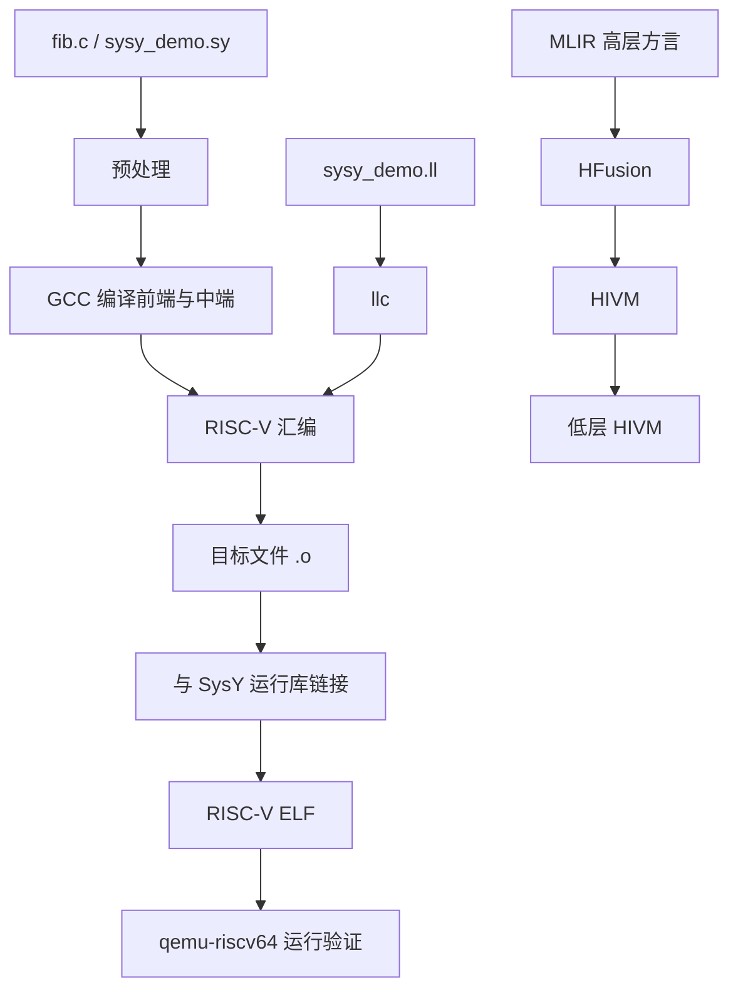
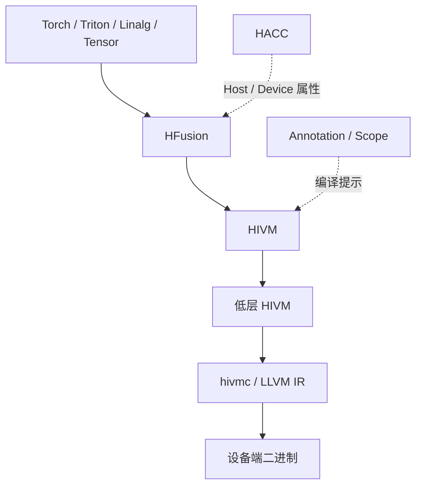

# 编译原理第一次上机作业实验报告

## 题目

SysY 简化编译器实现预备工作：GCC 编译过程、LLVM IR、RISC-V 汇编与 MLIR 中端探索

## 摘要

本实验围绕语言处理系统的完整工作过程和 RISC-V 目标程序生成展开。首先以斐波那契程序为例，使用 SiFive GCC 10.2 研究预处理器、编译器、汇编器和链接器的作用，生成并分析了预处理文件、Tree、GIMPLE、RTL、RISC-V 汇编、目标文件和可执行文件。随后设计了一份覆盖常量、函数、条件分支、循环、`break`、`continue`、算术和逻辑运算的 SysY 示例程序，分别实现了等价的 LLVM IR 和手写 RISC-V 汇编，并使用同一组测试完成验证。最后对 AscendNPU IR 的 MLIR 中端进行了探索，实际观察到 AIV 核类型推断、片上内存规划、流水同步插入以及 `hivm.hir.vadd` 到 `linalg.add` 再到 LLVM dialect 的逐层 lowering。实验结果表明，两条基础实现路线在相同输入下输出完全一致，LLVM IR 和 MLIR 都体现了中间表示对于目标无关优化和目标相关代码生成的桥梁作用。

## 关键词

编译原理；GCC；LLVM IR；RISC-V；SysY；MLIR；AscendNPU IR；代码生成

## 1 引言

编译原理实验的目标不仅是把源程序翻译成目标程序，更重要的是理解不同处理阶段之间如何传递信息、不同中间表示如何逐步降低抽象层次，以及前端语义如何最终映射到特定硬件。

第一次作业包含三个部分：

1. 研究 GCC 从 C 源程序到 RISC-V 目标程序的完整工作过程；
2. 设计 SysY 示例程序，编写等价的 LLVM IR 和 RISC-V 汇编，并链接 SysY 运行库验证结果；
3. 可选探索 AI 编译器 MLIR 的多层方言和渐进式 lowering 过程。

本实验统一选择 RISC-V 64 位方向。基础汇编、链接和运行均使用 SiFive GCC 10.2 工具链，以及 `qemu-riscv64`。

## 2 实验分工与环境

### 2.1 两人分工

本实验由刘国全、刘昀皓共同完成，具体分工如下。

| 成员 | 主要负责内容 |
| --- | --- |
| 刘国全 | GCC 预处理器和编译器各阶段分析、SysY 示例设计、LLVM IR、MLIR 方言与 lowering 分析、实验整合 |
| 刘昀皓 | 汇编器和链接器分析、手写 RISC-V 汇编、ABI 与目标代码验证、进阶 IR 证据复核 |
| 两人共同 | 测试用例、输入输出契约、交叉复核、报告撰写和最终结论 |

基础要求第一部分中，刘国全负责预处理与编译器阶段，刘昀皓负责汇编器、链接器和运行验证。

基础要求第二部分中，两人共用同一份 SysY 源程序和测试契约；刘国全负责 LLVM IR 路线，刘昀皓负责手写 RISC-V 汇编路线。

进阶要求由两人共同调研，刘国全重点分析 MLIR 方言与 lowering pipeline，刘昀皓复核实际 IR 变化和报告素材。

### 2.2 实验环境

| 项目 | 环境 |
| --- | --- |
| 操作系统 | WSL2 + Ubuntu 24.04 |
| 主机架构 | x86-64 |
| 目标架构 | RISC-V 64 位 |
| 编译器 | SiFive GCC-Metal 10.2.0 |
| 汇编器 | SiFive GNU as 2.35 |
| 链接器 | SiFive GNU ld 2.35 |
| ABI | RV64IMAFDC / LP64D |
| LLVM | 18.1.3 |
| QEMU | `qemu-riscv64` 8.2.2 |
| MLIR 工具 | AscendNPU IR 1.1.0，内部使用 LLVM 19.1.7 |

目标三元组：

```text
riscv64-unknown-elf
```

## 3 总体技术路线



图 1　本实验的主要处理路线

本实验所有最终测试均以 RISC-V 为目标，不使用其他目标架构作为最终实现。

## 4 基础要求第一部分：GCC 语言处理系统

### 4.1 实验程序

第一部分采用斐波那契数列程序：

```c
#include <stdio.h>

int getint(void);
void putint(int value);
void putch(int value);

int main()
{
    int a, b, i, n, t;

    n = getint();

    a = 0;
    b = 1;
    i = 1;

    putint(a);
    putch(10);
    putint(b);
    putch(10);

    while (i < n)
    {
        t = b;
        b = a + b;
        putint(b);
        putch(10);
        a = t;
        i = i + 1;
    }

    return 0;
}
```

该程序包含变量声明、赋值、函数调用、算术运算、关系运算、循环和返回语句。

### 4.2 预处理阶段

预处理命令：

```bash
riscv64-unknown-elf-gcc -E fib.c -o fib.i
```

预处理前后的规模如下：

| 文件 | 行数 | 字节数 | 说明 |
| --- | ---: | ---: | --- |
| `fib.c` | 33 | 390 | 原始 C 程序 |
| `fib.i` | 1302 | 44425 | 头文件展开后的结果 |

预处理阶段完成了：

1. `#include <stdio.h>` 的递归展开；
2. 系统头文件中的宏、类型和函数声明插入；
3. 源文件行号标记保留；
4. 注释删除；
5. `getint`、`putint`、`putch` 等声明保留。

预处理输出仍然是 C 语言级别，不涉及目标机器指令。

### 4.3 编译器阶段

编译器将预处理后的 C 程序转换为 RISC-V 汇编。本实验额外保留了 GCC 的 Tree、GIMPLE 和 RTL 输出。

| 中间表示 | 文件 | 主要意义 |
| --- | --- | --- |
| Tree | `fib.c.original` | 显示语法分析和初步语义树 |
| GIMPLE | `fib.c.gimple` | 使用基本块和跳转表达控制流 |
| RTL expand | `fib.c.rtl-expand` | 将 GIMPLE 展开为接近机器的 RTL |
| RTL final | `fib.c.rtl-final` | 寄存器分配和指令选择后的结果 |

GIMPLE 中的循环结构可以概括为：

```text
while_cond:
  if (i < n) goto loop_body; else goto while_end;

loop_body:
  t = b;
  b = a + b;
  putint(b);
  putch(10);
  a = t;
  i = i + 1;
  goto while_cond;

while_end:
  return 0;
```

编译器主要完成了：

1. 词法分析；
2. 语法分析；
3. 变量、函数调用和类型检查；
4. 生成 GIMPLE；
5. 转换为 RTL；
6. 进行寄存器分配和 RISC-V 指令选择；
7. 输出 RISC-V 汇编。

### 4.4 RISC-V 汇编阶段

`-O0` 汇编命令：

```bash
riscv64-unknown-elf-gcc \
  -S -O0 -g -fno-pic -mcmodel=medany \
  fib.c -o fib.s
```

主要汇编片段：

```asm
addi    sp,sp,-48
sd      ra,40(sp)
sd      s0,32(sp)
addi    s0,sp,48

call    getint
mv      a5,a0
sw      a5,-32(s0)

sw      zero,-20(s0)
li      a5,1
sw      a5,-24(s0)

lw      a5,-20(s0)
mv      a0,a5
call    putint

li      a0,10
call    putch

addw    a5,a4,a5
addiw   a5,a5,1
sext.w  a4,a4
sext.w  a5,a5
blt     a4,a5,.L3
```

可以看出：

- `sp` 在函数入口处分配栈帧；
- `ra` 和 `s0` 被保存；
- 函数返回值通过 `a0` 传递；
- `lw`/`sw` 访问局部变量；
- `addw`/`addiw` 执行 32 位整数运算；
- `sext.w` 将 32 位结果符号扩展到 64 位寄存器；
- `blt` 实现循环条件。

### 4.5 `-O0` 和 `-O2` 对比

| 项目 | `-O0` | `-O2` |
| --- | ---: | ---: |
| 汇编行数 | 349 | 53 |
| 字节数 | 4837 | 787 |
| 局部变量 | 主要放栈 | 尽量放寄存器 |
| 循环结构 | 直接对应源程序 | 经过简化和寄存器化 |
| 外部调用 | 保留 | 保留 |

`-O2` 减少了栈访问和临时指令，但不会删除 `putint`、`putch` 等具有可观察副作用的调用。

### 4.6 汇编器和链接器阶段

将汇编转换为目标文件：

```bash
riscv64-unknown-elf-gcc \
  -march=rv64imafdc -mabi=lp64d \
  -c fib.s -o fib.o
```

`fib.o` 的主要特征：

```text
ELF64
REL
RISC-V
RVC
double-float ABI
```

目标文件中有：

- 已定义的 `main` 函数；
- 未定义的 `getint`、`putint`、`putch`；
- 调用和分支重定位项；
- `.text`、`.data`、`.bss`、`.riscv.attributes` 等节区。

助教提供的 `libsysy_riscv.a` 由较新的工具链构建，包含旧版 SiFive `ld 2.35` 不认识的 ISA 属性。为了使整条链路保持一致，本实验使用助教提供的 `sylib.c` 重新构建本地运行库：

```bash
riscv64-unknown-elf-gcc \
  -O2 -mcmodel=medany -fno-pic \
  -I../../lib -c ../../lib/sylib.c \
  -o artifacts/sifive-runtime/sylib.o

riscv64-unknown-elf-ar rcs \
  artifacts/sifive-runtime/libsysy_riscv_sifive.a \
  artifacts/sifive-runtime/sylib.o
```

链接命令：

```bash
riscv64-unknown-elf-gcc fib.o -o fib \
  -Lartifacts/sifive-runtime -lsysy_riscv_sifive \
  -static -mcmodel=medany \
  -Wl,--no-relax,-Ttext=0x90000000
```

链接器完成：

1. 解析 `getint`、`putint`、`putch` 等未定义符号；
2. 合并运行库目标文件；
3. 处理调用和跳转重定位；
4. 添加启动代码和静态 C 运行库；
5. 生成 RISC-V ELF 可执行文件。

### 4.7 运行验证

使用 QEMU：

```bash
printf '5\n' | qemu-riscv64 ./fib
```

测试结果：

| 输入 `n` | 输出 | 结果 |
| ---: | --- | --- |
| 0 | `0 1` | PASS |
| 1 | `0 1` | PASS |
| 5 | `0 1 1 2 3 5` | PASS |
| 10 | `0 1 1 2 3 5 8 13 21 34 55` | PASS |

第一部分已经形成完整闭环：

```text
fib.c -> fib.i -> fib.s -> fib.o -> fib -> QEMU
```

## 5 基础要求第二部分：SysY、LLVM IR 与 RISC-V 汇编

### 5.1 SysY 示例程序

示例程序包含：

- 全局常量；
- 函数定义和调用；
- `if-else`；
- `while`；
- `break` 和 `continue`；
- 算术运算；
- 关系运算；
- 逻辑运算 `&&`；
- 运行库输入输出；
- 返回值。

核心源代码：

```c
const int BASE = 3;
const int FACTOR = 2;

int is_even(int x)
{
    if (x % 2 == 0) {
        return 1;
    } else {
        return 0;
    }
}

int gcd(int a, int b)
{
    while (b != 0) {
        int t = a % b;
        a = b;
        b = t;
    }
    return a;
}

int main()
{
    int n = getint();
    int i = 1;
    int sum = 0;

    while (i <= n) {
        if (i == 4) {
            i = i + 1;
            continue;
        }

        if (i == 6) {
            break;
        }

        if (i > 0 && is_even(i)) {
            sum = sum + i;
        }

        i = i + 1;
    }

    int x = n + BASE;
    int y = n * FACTOR + 1;
    int mixed = (x + y) * 2 - (x / 2) + (y % 3);
    int g = gcd(x, y);

    putint(sum);
    putch(10);
    putint(mixed);
    putch(10);
    putint(g);
    putch(10);

    return 0;
}
```

输入输出契约：

1. 输入一个整数 `n`；
2. 第一行输出 `sum`；
3. 第二行输出 `mixed`；
4. 第三行输出 `gcd(x, y)`。

### 5.2 LLVM IR 实现

LLVM IR 目标：

```llvm
target triple = "riscv64-unknown-elf"
```

运行库声明：

```llvm
declare i32 @getint()
declare void @putint(i32)
declare void @putch(i32)
```

`is_even` 的核心：

```llvm
%remainder = srem i32 %x, 2
%is.zero = icmp eq i32 %remainder, 0
br i1 %is.zero, label %even, label %odd
```

`gcd` 使用 `alloca`、`load`、`store` 和 `srem` 表示循环中的可修改变量。

`main` 中显式实现了：

- `while` 条件块；
- `continue` 基本块；
- `break` 跳转；
- `&&` 短路求值；
- 算术运算；
- 函数调用。

LLVM IR 经过验证：

```bash
opt -passes=verify sysy_demo.ll -disable-output
```

结果为通过。

### 5.3 手写 RISC-V 汇编实现

手写汇编定义了：

```text
is_even
gcd
main
```

主要 ABI 约定：

- 参数放在 `a0/a1`；
- 返回值放在 `a0`；
- `main` 保存 `ra` 和使用的 `s1` 至 `s6`；
- 栈帧为 64 字节；
- `sp` 保持 16 字节对齐；
- 返回前恢复 callee-saved 寄存器。

`is_even`：

```asm
is_even:
    li      t0, 2
    remw    t1, a0, t0
    seqz    a0, t1
    ret
```

`gcd`：

```asm
gcd:
.L_gcd_cond:
    beqz    a1, .L_gcd_end
    remw    t0, a0, a1
    mv      a0, a1
    mv      a1, t0
    j       .L_gcd_cond
.L_gcd_end:
    ret
```

`main` 使用：

- `sext.w` 保证 32 位有符号比较正确；
- `addiw` 实现循环变量自增；
- `mulw`、`divw`、`remw` 实现混合表达式；
- `bne`、`beq`、`bgt`、`blez` 实现条件分支；
- `j` 实现 `continue` 和循环回边。

### 5.4 两条路线的工具链

为了保持与 SiFive GCC 10.2 一致，LLVM IR 先生成 RISC-V 汇编，再由 SiFive 汇编器处理：

```text
sysy_demo.ll
  -> llvm-as
  -> sysy_demo.bc
  -> llc -march=riscv64
  -> sysy_demo_llvm.s
  -> normalize_riscv_asm.py
  -> SiFive as 2.35
  -> sysy_demo.o
```

规范化脚本将 LLVM 生成的较新 ISA 属性改写为 SiFive 支持的：

```text
rv64i2p0_m2p0_a2p0_f2p0_d2p0_c2p0
```

手写汇编路线：

```text
sysy_demo_asm.s
  -> SiFive as 2.35
  -> sysy_demo_asm.o
```

两条路线均链接：

```text
artifacts/sifive-runtime/libsysy_riscv_sifive.a
```

### 5.5 测试结果

LLVM IR 路线：

```text
PASS n=0
PASS n=1
PASS n=3
PASS n=4
PASS n=5
PASS n=10
```

手写汇编路线：

```text
PASS n=0
PASS n=1
PASS n=3
PASS n=4
PASS n=5
PASS n=10
```

输出对照：

| 输入 `n` | 输出 `(sum, mixed, g)` |
| ---: | --- |
| 0 | `(0, 8, 1)` |
| 1 | `(0, 12, 1)` |
| 3 | `(2, 24, 1)` |
| 4 | `(2, 29, 1)` |
| 5 | `(2, 36, 1)` |
| 10 | `(2, 62, 1)` |

两条路线输出完全一致。

### 5.6 两种实现方式的对比

| 对比项 | LLVM IR | 手写 RISC-V 汇编 |
| --- | --- | --- |
| 抽象层次 | 接近机器模型的 SSA IR | 直接面向寄存器和指令 |
| 控制流 | 显式基本块 | 标签和分支跳转 |
| 寄存器 | 虚拟寄存器 | 物理寄存器 |
| 栈 | 由后端决定 | 人工设计 |
| ABI | 由后端遵守 | 人工遵守 |
| 目标生成 | `llc` 和汇编器 | 人工指令映射 |
| 验证方式 | QEMU 运行 | QEMU 运行 |

实验中发现，`sext.w` 是 RV64 正确处理 32 位有符号比较所需的指令。LLVM 后端与手写汇编都会采用这一方式，因此它不是 LLVM IR 和汇编语言之间的本质差异，而是目标 ISA 的要求。

## 6 进阶要求：MLIR 中端与 AscendNPU IR

### 6.1 任务目标

进阶要求要求观察 MLIR 的多层方言和渐进式 lowering：

```text
高层框架或高级 IR
  -> HFusion
  -> HIVM
  -> lower-level HIVM
  -> hivmc / LLVM IR
  -> 设备端二进制
```

本部分只要求观察编译器中端，不需要真实 NPU。实际完成情况以 `bishengir-opt` 产生的 IR 为证据。

### 6.2 MLIR 与 LLVM IR 的区别

LLVM IR 是相对单一层级的 SSA 中间表示，主要围绕函数、基本块、内存、算术和调用进行优化。

MLIR 是一个可以承载多种方言的框架：

- 同一 Module 中可以同时存在多种 Dialect；
- 高层方言保留计算结构；
- 转换 Pass 可以逐级降低；
- 硬件信息可以在较低层逐渐出现；
- 相同 IR 基础设施可以服务不同领域和硬件。

图 2 展示 AscendNPU IR 的主要层次。



图 2　AscendNPU IR 的逻辑层次

### 6.3 VecAdd 示例

VecAdd 使用 `memref` 表示 GM 和 UB 地址空间：

```mlir
func.func @add(
    %arg0: memref<16xi16, #hivm.address_space<gm>>,
    %arg1: memref<16xi16, #hivm.address_space<gm>>,
    %arg2: memref<16xi16, #hivm.address_space<gm>>)
    attributes {hacc.entry, hacc.function_kind = #hacc.function_kind<DEVICE>} {
```

其中：

- `gm` 表示全局内存；
- `ub` 表示 Unified Buffer；
- `hacc.entry` 表示入口；
- `DEVICE` 表示设备侧函数。

核心 Operation：

```text
hivm.hir.load
hivm.hir.vadd
hivm.hir.store
```

### 6.4 AIV 核类型推断

执行：

```bash
bishengir-opt vecadd.mlir \
  --hivm-infer-func-core-type \
  -o vecadd_hivm-infer-func-core-type.mlir
```

输出增加：

```text
hivm.module_core_type<AIV>
hivm.func_core_type<AIV>
```

由于该程序只包含向量加法，编译器将其识别为 AIV 向量核任务，不需要拆分 Cube 和 Vector。

### 6.5 片上内存规划

执行：

```bash
bishengir-opt vecadd_hivm-infer-func-core-type.mlir \
  --hivm-plan-memory \
  -o vecadd_hivm_core_plan.mlir
```

规划前后：

```text
memref.alloc
  ->
hivm.hir.pointer_cast(0)
hivm.hir.pointer_cast(32)
hivm.hir.pointer_cast(0)
```

观察结果：

- 两个输入缓冲区映射到 UB 偏移 `0` 和 `32`；
- 输出缓冲区复用偏移 `0`；
- 说明内存规划进行了生命周期分析；
- 片上缓冲区不是简单的一对一分配。

### 6.6 自动同步插入

执行：

```bash
bishengir-opt vecadd_hivm_core_plan.mlir \
  --hivm-inject-sync \
  -o vecadd_hivm_sync.mlir
```

新增同步：

```mlir
hivm.hir.set_flag[<PIPE_MTE2>, <PIPE_V>, <EVENT_ID0>]
hivm.hir.wait_flag[<PIPE_MTE2>, <PIPE_V>, <EVENT_ID0>]

hivm.hir.set_flag[<PIPE_V>, <PIPE_MTE3>, <EVENT_ID0>]
hivm.hir.wait_flag[<PIPE_V>, <PIPE_MTE3>, <EVENT_ID0>]

hivm.hir.pipe_barrier[<PIPE_ALL>]
```

其含义是：

1. 输入搬运完成后才能执行向量计算；
2. 向量计算完成后才能写回；
3. 函数结束前加入全局流水屏障。

### 6.7 HIVM 到上游方言

CPU 观察版输入：

```mlir
%sum = hivm.hir.vadd ins(%a, %b : tensor<16xi16>, tensor<16xi16>)
                        outs(%out : tensor<16xi16>) -> tensor<16xi16>
```

执行：

```bash
bishengir-opt vecadd_host_for_cpu.mlir \
  --execution-engine-convert-hivm-to-upstream
```

结果：

```mlir
%1 = linalg.add ins(%arg0, %arg1 : tensor<16xi16>, tensor<16xi16>)
                outs(%0 : tensor<16xi16>) -> tensor<16xi16>
```

这是 MLIR 中“保持语义、改变方言表示”的直接证据。

### 6.8 完整 lowering Pipeline

执行 CPU runner pipeline 后，IR 经历：

```text
HIVM
  -> Linalg
  -> Bufferization
  -> Loops
  -> SCF / CF
  -> LLVM dialect
```

最终输出包含：

```text
llvm.func
llvm.call
llvm.load
llvm.store
llvm.getelementptr
llvm.cond_br
```

该过程表明 MLIR 能够在不丢失源语义的情况下，把高层结构化 Operation 逐级降低到接近 LLVM 的表示。

### 6.9 进阶部分结论

本实验观察到 MLIR 与 LLVM IR 的主要差异：

1. LLVM IR 主要是一种相对固定的 SSA IR；
2. MLIR 提供多种方言，允许不同抽象层次共存；
3. HFusion 保留高层结构化计算语义；
4. HIVM 引入 Tile、GM/UB、同步和硬件内存约束；
5. lowering 不是一次完成，而是由多个 Pass 和方言转换逐步完成；
6. 对 AI 编译器而言，多层表示更适合算子融合、切块、内存规划和硬件调度。

本任务关注编译器中端，因此不需要真实 NPU、CANN 或设备上板。

## 7 实验结果汇总

| 实验内容 | 主要产物 | 验证结果 |
| --- | --- | --- |
| GCC 预处理与编译 | `fib.i`、`fib.s`、Tree、GIMPLE、RTL | 成功 |
| GCC 汇编器与链接器 | `fib.o`、`fib` | 成功 |
| 第一部分 QEMU | `artifacts/tests/` | 4 组通过 |
| SysY 示例 | `sysy_demo.sy` | 覆盖基础语言特性 |
| LLVM IR | `sysy_demo.ll` | `opt` 验证通过 |
| LLVM IR 目标程序 | `sysy_demo` | 6 组通过 |
| 手写 RISC-V 汇编 | `sysy_demo_asm.s` | 6 组通过 |
| ABI | RV64IMAFDC / LP64D | 链接和运行成功 |
| MLIR AIV 推断 | `vecadd_hivm-infer-func-core-type.mlir` | 成功 |
| 片上内存规划 | `vecadd_hivm_core_plan.mlir` | 成功 |
| 自动同步 | `vecadd_hivm_sync.mlir` | 成功 |
| HIVM 方言转换 | `vecadd_host_linalg.mlir` | 成功 |
| 完整 CPU lowering | `vecadd_host_cpu_pipeline.mlir` | 成功 |

## 8 问题与解决

### 8.1 二进制运行库 ISA 属性不兼容

问题：

```text
unknown z ISA extension `zmmul'
```

原因：

- 提供的二进制运行库由较新的工具链构建；
- SiFive GNU ld 2.35 无法合并新的 ISA 属性。

解决：

- 保留助教提供的 `sylib.c`；
- 使用 SiFive GCC 10.2 重新编译；
- 生成本地 `libsysy_riscv_sifive.a`；
- 保持整个后续过程使用 SiFive 工具链。

### 8.2 LLVM 生成的汇编 ISA 属性版本较高

解决：

- 保留 LLVM 生成的指令；
- 使用 `normalize_riscv_asm.py` 将 ISA 版本属性规范化为 SiFive 支持的 RV64IMAFDC 2.0；
- 再由 SiFive 汇编器和链接器处理。

### 8.3 32 位整数比较

RV64 寄存器宽度为 64 位，SysY 的 `int` 为 32 位。因此有符号比较前需要：

```text
sext.w
```

这是源语言语义与目标 ISA 之间的适配，不是 LLVM IR 与汇编语言之间的简单高低级差别。

## 9 结论

1. 本实验完整观察了预处理、编译、汇编、链接和运行五个主要阶段。
2. GCC 的 Tree、GIMPLE 和 RTL 清楚展示了逐步降低的编译过程。
3. 生成的 RISC-V 目标文件、可执行文件和符号重定位结果符合 LP64D ABI。
4. SysY 示例覆盖常量、函数、循环、分支、`break`、`continue` 和多种运算。
5. LLVM IR 与手写 RISC-V 汇编两条路线在 6 组测试中输出完全一致。
6. MLIR 相比 LLVM IR 具有更明显的多层方言和渐进式 lowering 特征。
7. AscendNPU IR 在 HIVM 层引入 AIV、UB、同步和内存规划等硬件信息。
8. 最终基础实验统一使用 SiFive GCC 10.2 工具链，并完成 QEMU 验证。

## 10 参考文献

[1] 课程组. SysY 语言定义（2022 版）[Z]. `SysY2022语言定义-V1.pdf`.

[2] 课程组. SysY 运行时库（2022 版）[Z]. `SysY2022运行时库-V1.pdf`.

[3] 课程组. SysY 文法补充说明[Z]. `SysY文法补充说明.pdf`.

[4] 课程组. 了解编译器——LLVM IR 编程[Z]. `了解编译器___LLVM_IR编程.pdf`.

[5] AscendNPU IR. 编译与执行示例[EB/OL]. https://ascendnpu-ir.gitcode.com/zh_cn/sources/introduction/quick_start/examples_zh.html.

[6] AscendNPU IR. 构建安装[EB/OL]. https://ascendnpu-ir.gitcode.com/zh_cn/sources/introduction/quick_start/installing_guide_zh.html.

[7] 华为. CANN 编译器与毕昇编译器[EB/OL]. https://www.hiascend.com/cann/bisheng.

[8] MLIR Project. Multi-Level Intermediate Representation[EB/OL]. https://mlir.llvm.org/.

[9] RISC-V International. RISC-V ABIs Specification[EB/OL]. https://riscv.org/technical/specifications/.

[10] GCC Project. GNU Compiler Collection Documentation[EB/OL]. https://gcc.gnu.org/onlinedocs/.

## 附录 A 复现命令

### A.1 第一部分

```bash
cd first_assignment/part1_gcc
make -B all verify inspect environment
```

### A.2 第二部分

```bash
cd first_assignment/part2_sysy_llvm_riscv
make -B all verify inspect asm-inspect environment
```

### A.3 进阶部分

```bash
cd first_assignment/advanced_mlir
make -B all
make verify
```

## 附录 B 主要文件索引

```text
first_assignment/
├── 交接回执_刘国全.md
├── part1_gcc/
│   ├── fib.c
│   ├── 阶段分析.md
│   └── artifacts/
├── part2_sysy_llvm_riscv/
│   ├── sysy_demo.sy
│   ├── sysy_demo.ll
│   ├── sysy_demo_asm.s
│   ├── 阶段验证.md
│   ├── 交接文档_刘昀皓.md
│   └── artifacts/
└── advanced_mlir/
    ├── vecadd.mlir
    ├── vecadd_host_for_cpu.mlir
    ├── MLIR中端_lowering分析.md
    ├── 交接文档_刘昀皓_进阶部分.md
    └── artifacts/
```

## 附录 C 报告状态

本文件为 Markdown 版实验报告，内容已经覆盖第一次作业要求的：

- 题目；
- 摘要；
- 关键词；
- 引言；
- 实验分工；
- 工作与结果；
- 结论；
- 参考文献；
- 图表和复现实验记录。

投稿前可在 Overleaf 或 Markdown 转 PDF 工具中进一步完成目录、页码、浮动图表和参考文献样式排版。
